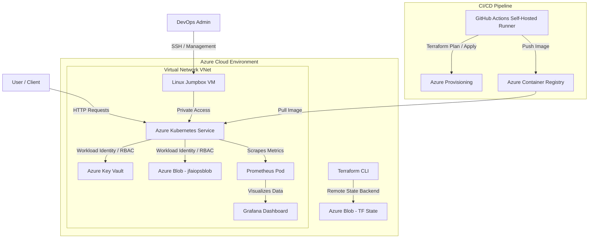

# Cloud-Native Azure AIOps & ML Telemetry Platform

An enterprise-grade Azure infrastructure and containerized AIOps platform built using Infrastructure as Code (Terraform), Kubernetes (AKS), and GitHub Actions. Features a Python-based ML microservice performing real-time request anomaly detection using passwordless Azure Managed Identity authentication.

---

##  Architecture Diagram

## Architecture Overview

    Cloud Provider: Microsoft Azure

    Networking: Single Virtual Network (VNet) hosting AKS cluster and Linux Jumpbox VM (Transition to enterprise Hub-and-Spoke VNet Peering in progress).

    Infrastructure as Code: 100% parameterized, layered Terraform directory architecture (1-networking, 2-security, 3-storage, 4-compute).

    Container Orchestration: Azure Kubernetes Service (aiops-cluster) & Azure Container Registry (aiopsregistry15069).

    Application Stack: Python FastAPI microservice engine:

        Real-time Anomaly Detection: Scikit-learn IsolationForest model identifying irregular telemetry patterns.

        Predictive Analytics: Meta Prophet time-series model forecasting infrastructure load.

    Security & Auth: Passwordless authentication via DefaultAzureCredential (azure-identity) and Azure RBAC (Storage Blob Data Contributor), Key Vault, and minimum TLS 1.2 enforcement on storage accounts.

    FinOps & Cost Strategy: On-demand infrastructure lifecycle management via Terraform CLI to maintain a minimal cloud cost footprint during testing.

## AI-Assisted Engineering & Critical Verification

    While generative AI was used to accelerate initial architecture drafting and code prototyping, relying on AI outputs required active verification, technical research, and manual troubleshooting.

    Security Overrides: Corrected insecure AI recommendations that suggested hardcoding secrets directly into main.py and environment files, overriding them with zero-trust passwordless Azure Workload Identities (azure-identity).

    Debugging AI Hallucinations: Resolved contradictory guidance around Kubernetes manifest parameters, Terraform state bindings, and broken syntax in Mermaid diagrams.

    Hands-on Problem Solving: Independently diagnosed Kubernetes CrashLoopBackOff states, fixed Prometheus scraper target misconfigurations, and re-architected pipeline safety controls when CI runners attempted self-destruction.

## Key Technical Highlights & Engineering Journey

    Passwordless Workload Identity: Completely eliminated hardcoded connection strings and long-lived API tokens across Python microservices (main.py, telemetry_producer.py, telemetry_consumer.py) in favor of DefaultAzureCredential bound to Azure RBAC roles.

    Predictive AI/ML Telemetry Engine: Deployed real-time anomaly detection (IsolationForest) and predictive time-series forecasting (Prophet) directly on Kubernetes to anticipate infrastructure bottlenecks.

    Fully Parameterized Layered IaC: Modularized Terraform configurations into strict sequence-based layers (1-networking to 4-compute) using a global variables.tf pattern for clean state separation and zero-drift deployments.

    Resilient Kubernetes Operations: Diagnosed and resolved container runtime challenges (including CrashLoopBackOff states, pod logs inspection, and Prometheus metric scraping endpoints).

    Self-Hosted CI/CD Safety Gate: Configured GitHub Actions executing on a self-hosted Jumpbox VM runner, enforcing read-only terraform plan guardrails on compute layers to prevent accidental pipeline self-destruction.

## Key Lessons & Operational Insights

    Self-Hosted Runner Lifecycle Isolation: An SSH key mismatch in Terraform code previously triggered a self-hosted CI process on the Jumpbox VM to attempt its own destruction mid-execution.

    Remote State Decoupling: Because Terraform state was safely preserved in remote Azure Blob Storage, no cloud resources or deployment states were corrupted. The management VM and toolbelt were rapidly re-provisioned via Cloud Shell with zero loss of platform state.

    Read-Only Pipeline Guardrails: Implemented a pipeline safety gate ensuring compute and cluster modifications require explicit terraform plan approval before apply execution.

## Tech Stack

    Azure | Terraform | Kubernetes (AKS) | Docker | Python (FastAPI) | Scikit-learn | GitHub Actions | Prometheus | Grafana | Azure Blob Storage

## Implementation Status & Roadmap

    [x] Layered IaC Parameterization: 100% parameterized Terraform modules across networking, security, storage, and compute directories.

    [x] Passwordless RBAC Integration: Implemented azure-identity (DefaultAzureCredential) for storage access across application microservices.

    [x] AIOps ML Engine: Integrated IsolationForest anomaly detection and Prophet time-series load forecasting.

    [x] Self-Hosted Runner Security: Re-provisioned Linux Jumpbox VM with full toolbelt and configured read-only terraform plan CI/CD safety gates.

    [ ] Hub-and-Spoke Topology: Transition single VNet deployment into an enterprise Hub-and-Spoke network architecture with Azure Firewall & VNet Peering.

    [ ] Policy as Code & Governance: Implement Azure Policy / OPA rules to enforce network isolation and security compliance automatically.

    [ ] Automated Jumpbox Provisioning: Codify Jumpbox toolbelt bootstrap scripts to enable 100% automated VM regeneration.
